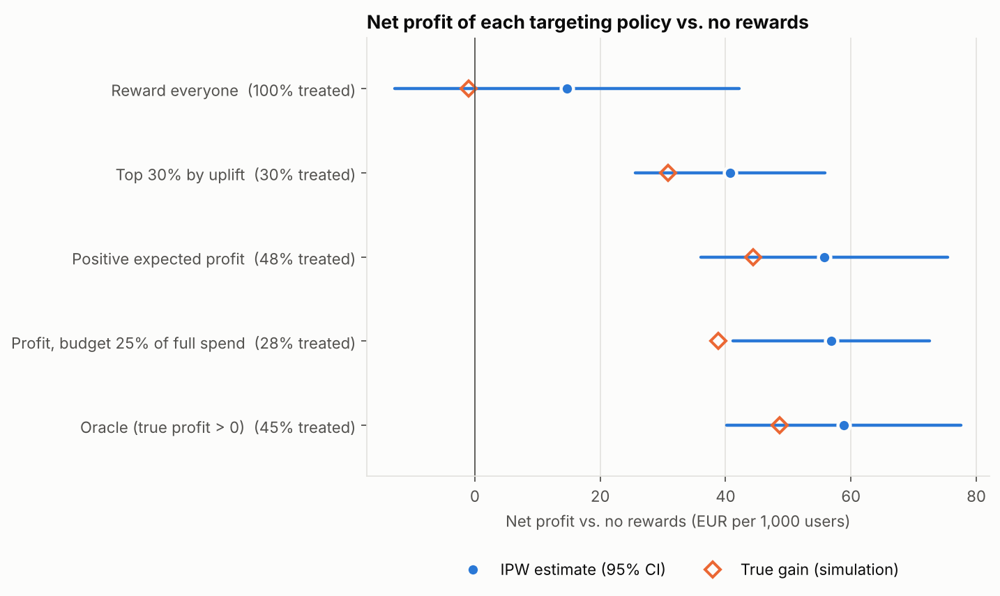
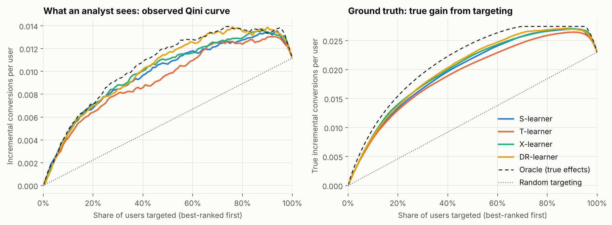

# Reward Uplift Lab

[](https://github.com/manojrevenkar12-web/reward-uplift-lab/actions/workflows/ci.yml)

**Should a rewards app give everyone a bonus, and if not, who should get it?**

This project answers that question end to end, the way a product data scientist would: check the experiment is trustworthy, measure the average effect precisely, find out who actually responds, and turn that into a targeting rule that makes money. Every method is validated against **known ground truth** before it is trusted, and the observable parts also run on the public **Criteo Uplift** dataset (≈14 million users).

The full study regenerates from one command in about 20 seconds: [`reports/simulation/REPORT.md`](reports/simulation/REPORT.md).

## The answer

| Question | Finding (200,000 simulated users, seed 7) |
|---|---|
| Does the €0.50 bonus work? | It lifts conversion by **+2.40 points** (true +2.28), an 18% relative lift. |
| Does it pay for itself? | **Not when given to everyone**: net profit change €+0.011 per user, 95% CI [−0.003, +0.024] (true −0.002). Much of the bonus goes to users who would have converted anyway. |
| Who should get it? | Users with positive *expected profit*: `payout × uplift − cost × P(convert if rewarded)`. Rewarding that **48%** earns **€41 more per 1,000 users** than rewarding everyone, CI [22, 60] (true €45). |
| Can we trust the experiment? | Sample-ratio check passes on the healthy pipeline and **catches an injected logging bug** (p = 3.5×10⁻⁹). A/A tests show a 5.0% false-positive rate at α = 0.05. |
| How do we decide faster? | **CUPED** with pre-period revenue cuts estimator variance by **35%**, the same precision as 53% more users. |
| Can we check results daily? | Not with ordinary p-values: stopping at the first p < 0.05 over 50 looks gives **31.6%** false positives. **Always-valid (mSPRT) p-values** keep it at 1.2%. |



## Why simulation first, then real data

Real experiments never reveal an individual's treatment effect, so an uplift model can never be scored directly against the truth. The simulator generates users *together with* their potential outcomes, so every estimator here is checked against the right answer before it is used where no answer exists. The data-generating process is a plausible rewards app: new and low-activity users respond strongly, paid-social users somewhat more, heavy offer-completers respond **negatively** (reward fatigue), and payouts differ by country, so positive uplift is not always profitable. Pre-period revenue is correlated with in-experiment revenue, as in real products.

The real-data run (`uplift-lab criteo`, or the [Colab notebook](notebooks/criteo_colab.ipynb)) repeats everything that can be observed without ground truth: sample-ratio check, average effect, and uplift-model comparison by held-out Qini area.

## On real data: Criteo Uplift

A 10% random sample of the Criteo dataset (1,397,959 users; outcome: site visit) gives ([`reports/criteo/REPORT.md`](reports/criteo/REPORT.md)):

- **The experiment is clean.** 85.05% of users are treated against a designed 85% (sample-ratio test p = 0.08).
- **Advertising lifts visits by 1.03 points** [0.94, 1.12], a 27% relative lift.
- **The effect is concentrated.** The 10% of users the X-learner ranks highest show a **5.3-point lift**, five times the average; below the top three deciles the lift is under 0.2 points. Predicted and observed uplift agree decile by decile.
- **Model choice holds up out of sample.** The X-learner has the highest Qini area on both the validation split (0.0031) and the separate test split (0.0029); the T-learner is weakest on both, as in the simulation.


## What the study does

| Step | Method | Code |
|---|---|---|
| 1. Trust the data | Sample ratio mismatch (χ² goodness of fit, p < 0.001 alarm) on a healthy and a deliberately broken pipeline | [`experiment/srm.py`](src/uplift_lab/experiment/srm.py) |
| 2. Average effect | Difference in means (Welch SE), relative lift (delta method), **CUPED** (Deng et al. 2013), **Lin (2013) regression adjustment** with HC1 robust SEs | [`estimators.py`](src/uplift_lab/experiment/estimators.py), [`variance_reduction.py`](src/uplift_lab/experiment/variance_reduction.py) |
| 3. Calibrate the analysis | **A/A tests**: false-positive rate with a Wilson interval, KS test of p-value uniformity | [`aa.py`](src/uplift_lab/experiment/aa.py) |
| 4. Plan the next test | Sample size for proportions and means, minimum detectable effect, with and without CUPED | [`power.py`](src/uplift_lab/experiment/power.py) |
| 5. Monitor safely | Peeking simulation; **mSPRT always-valid p-values** (Johari et al. 2017) | [`sequential.py`](src/uplift_lab/experiment/sequential.py) |
| 6. Who responds? | **S-, T-, X- and DR-learners** (cross-fitted), selected on a validation split, scored on a test split by Qini curve and, in simulation, by PEHE and rank correlation with the truth | [`uplift/metalearners.py`](src/uplift_lab/uplift/metalearners.py), [`evaluation.py`](src/uplift_lab/uplift/evaluation.py) |
| 7. Who should get it? | Expected-profit targeting with an optional budget (greedy knapsack on profit per euro), evaluated **off-policy** by inverse-propensity weighting on held-out randomised users | [`uplift/policy.py`](src/uplift_lab/uplift/policy.py) |
| SQL | Arm summary, segment lifts with SEs, lift by score decile (DuckDB; plain `.sql` files) | [`sql/`](src/uplift_lab/sql) |



*Left: what an analyst can see. Right: the hidden truth. The curves drop at the far right because the last users ranked are the ones the reward puts off.*

## Is it robust? Same study, ten different draws of the data

One seed is one experiment. A finding is only worth stating if it survives a re-run, so [`scripts/seed_robustness.py`](scripts/seed_robustness.py) repeats the study on ten seeds (money per 1,000 users):

| Seed | CUPED variance cut | Blanket reward: net profit | Profit targeting vs. blanket | Selected model (share of oracle gain) | Best model by truth |
|---|---|---|---|---|---|
| 1 | 35% | €−12 [−26, +1] (true €−1) | €43 [22, 64] (true €41) | S-learner (76%) | X-learner (85%) |
| 2 | 35% | €+11 [−3, +25] (true €−2) | €32 [13, 50] (true €44) | DR-learner (84%) | X-learner (88%) |
| 3 | 35% | €+1 [−13, +14] (true €−2) | €48 [26, 70] (true €40) | S-learner (78%) | X-learner (85%) |
| 4 | 35% | €−20 [−34, −6] (true €−2) | €57 [35, 78] (true €43) | S-learner (84%) | X-learner (88%) |
| 5 | 35% | €+4 [−10, +17] (true €−2) | €28 [7, 49] (true €44) | S-learner (83%) | X-learner (92%) |
| 6 | 35% | €−15 [−29, −1] (true €−2) | €55 [35, 76] (true €46) | X-learner (89%) | X-learner (89%) |
| 7 | 35% | €+11 [−3, +24] (true €−2) | €41 [22, 60] (true €45) | DR-learner (87%) | DR-learner (87%) |
| 8 | 35% | €+4 [−10, +17] (true €−1) | €36 [13, 58] (true €41) | S-learner (76%) | X-learner (85%) |
| 9 | 35% | €−2 [−16, +12] (true €−2) | €49 [30, 68] (true €46) | X-learner (91%) | X-learner (91%) |
| 10 | 35% | €−1 [−15, +13] (true €−2) | €46 [26, 66] (true €46) | DR-learner (91%) | DR-learner (91%) |

What holds, and what does not:

- **Profit targeting beats the blanket reward in all ten runs**, with every interval above zero.
- **The blanket reward's profit is about zero** (true −€1 to −€2 per 1,000 users). One interval in ten misses the truth, as a 95% interval should about one time in twenty.
- **Model selection by observed Qini is unreliable.** It picks the truly best learner in only 4 of 10 runs, and often prefers the S-learner, which is never best by the truth. The learners' Qini areas are close together, and one validation split is too noisy to separate them reliably. Practical consequence: a careful analyst should prefer a learner for structural reasons (here the X- or DR-learner) or use much larger validation sets, rather than trusting a small difference in Qini.

The off-policy estimator itself is checked separately by [`scripts/policy_estimator_calibration.py`](scripts/policy_estimator_calibration.py): over 150 simulated experiments its standardised error averages −0.01 (SE 0.08), with a standard deviation of 0.96, and its 95% intervals cover the truth 96% of the time.

## Run it

```bash
git clone https://github.com/manojrevenkar12-web/reward-uplift-lab.git
cd reward-uplift-lab
pip install -e ".[dev]"

uplift-lab -v simulate --out reports/simulation      # full study, ~20 s
pytest                                                # 72 tests, incl. statistical checks
pytest -m "not slow"                                  # fast subset
```

Real data: the original Criteo download link no longer serves the file, so use the [mirror published with libuplift](https://github.com/jszymon/uplift_sklearn_data/releases/download/Criteo/criteo-research-uplift-v2.1.csv.gz) (311 MB; dataset described on the [Criteo AI Lab page](https://ailab.criteo.com/criteo-uplift-prediction-dataset/)), then

```bash
uplift-lab -v criteo data/criteo-research-uplift-v2.1.csv.gz --outcome visit --sample-frac 0.1
```

or open [`notebooks/criteo_colab.ipynb`](notebooks/criteo_colab.ipynb) in Google Colab. Each command writes `results.json` (every number), `REPORT.md` (rendered from that JSON, so text and numbers cannot disagree) and `figures/`.

The library can also be used directly:

```python
from uplift_lab.experiment import cuped, sample_ratio_mismatch
from uplift_lab.uplift import XLearner, qini_curve

sample_ratio_mismatch(df["treatment"], expected_treatment_share=0.5)
cuped(df["revenue"], df["treatment"], covariate=df["pre_revenue"]).effect
tau_hat = XLearner().fit(X_train, t_train, y_train).predict_uplift(X_test)
qini_curve(y_test, t_test, tau_hat).area_over_random()
```

## Engineering

- **Tested for statistical correctness, not just for running.** Besides formula checks against hand calculations, the `slow` tests verify by simulation that the estimators are unbiased, that 95% intervals cover at the nominal rate, that A/A tests flag a deliberately overconfident estimator, and that peeking inflates false positives while the mSPRT does not. 72 tests, 97% line coverage.
- **No leakage by construction.** Features use pre-treatment attributes only (a test enforces it). Uplift models are selected on a validation split and reported on a separate test split. The CUPED coefficient for policy evaluation is fitted on training users.
- **Reproducible.** Every random draw is seeded, and each split uses its own random stream so that changing one never shifts another.
- **Typed and linted.** `mypy --strict` and Ruff (including docstring rules) run in CI on Python 3.11 to 3.13; CI also regenerates the study and uploads the report.

```
src/uplift_lab/
├── data/          simulator with ground truth, Criteo loader, feature matrix
├── experiment/    SRM, estimators, CUPED and Lin adjustment, A/A, power, mSPRT
├── uplift/        meta-learners, Qini and truth metrics, profit policies, IPW evaluation
├── sql/           DuckDB queries as plain .sql files
├── pipeline.py    the two studies, end to end
├── report.py      Markdown report generated from results.json
├── plots.py       figures
└── cli.py         `uplift-lab simulate | criteo`
```

## Limitations

- The business conclusions come from simulated data whose behaviour I designed; the simulation validates the **methods**, not the numbers. The Criteo run shows the methods on real data, where no ground truth exists.
- A 14-day window misses longer-term effects: rewards can pull conversions forward in time or make users wait for bonuses.
- Payout per conversion is treated as a known price per country tier, and the targeting rule depends on the conversion model being calibrated.
- Policies are compared on the same held-out users, so their errors are correlated; the paired comparisons in the report account for this.

## References

- Deng, Xu, Kohavi, Walker (2013). *Improving the Sensitivity of Online Controlled Experiments by Utilizing Pre-Experiment Data.* WSDM.
- Lin (2013). *Agnostic notes on regression adjustments to experimental data.* Annals of Applied Statistics.
- Johari, Koomen, Pekelis, Walsh (2017). *Peeking at A/B Tests: Why it matters, and what to do about it.* KDD.
- Künzel, Sekhon, Bickel, Yu (2019). *Metalearners for estimating heterogeneous treatment effects using machine learning.* PNAS.
- Kennedy (2023). *Towards optimal doubly robust estimation of heterogeneous causal effects.* Electronic Journal of Statistics.
- Radcliffe (2007). *Using control groups to target on predicted lift.* Direct Marketing Analytics Journal.
- Diemert, Betlei, Renaudin, Amini (2018). *A Large Scale Benchmark for Uplift Modeling.* AdKDD.

---

Built by [Manoj Kumar Prakash](https://linkedin.com/in/manoj-kumar-prakash-52b7a01b6). MIT licence.
