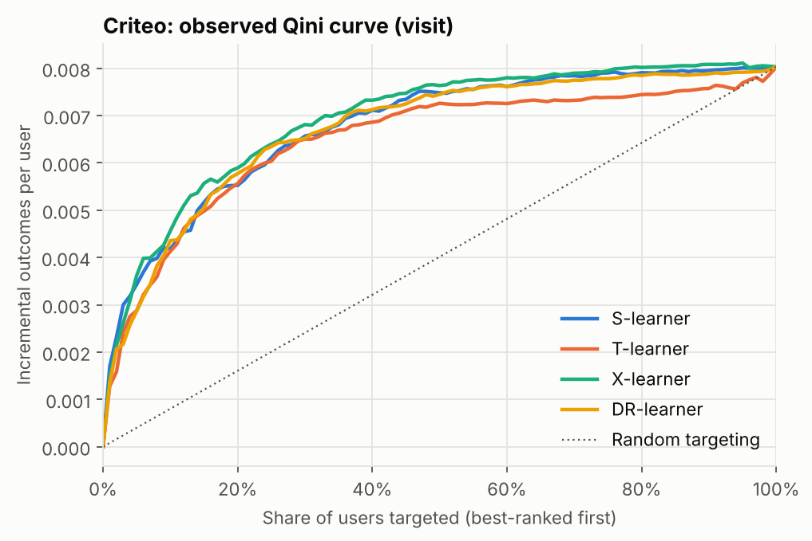
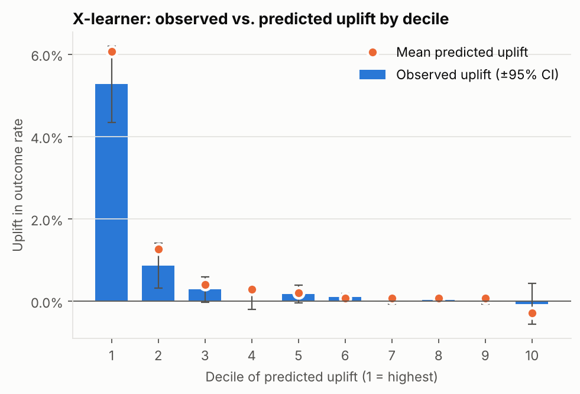

# Reward Uplift Lab: Criteo Uplift (real data)

1,397,959 users, outcome `visit`. Real data has no ground truth, so models are compared on held-out Qini areas and decile calibration only.

## Sample ratio

Observed treated share 85.05% vs designed 85% (p = 0.083, mismatch: no). The dataset documents its treatment share only approximately, so with millions of users a flag here can mean the true design share differs slightly from the documented one rather than a logging fault; check the observed share before drawing conclusions.

## Average effect

Difference in `visit` rate: +1.03 pts [+0.94 pts, +1.12 pts]; relative lift 27.0% [24.1%, 29.9%].

## Uplift models

| Model | Validation Qini | Test Qini |
|---|---|---|
| X-learner | 0.00308 | 0.00290 |
| S-learner | 0.00270 | 0.00274 |
| DR-learner | 0.00291 | 0.00269 |
| T-learner | 0.00254 | 0.00245 |

Selected model (by highest Qini area on a validation split of the training users): **X-learner**.

