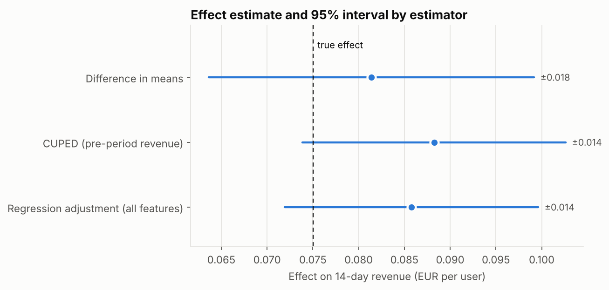
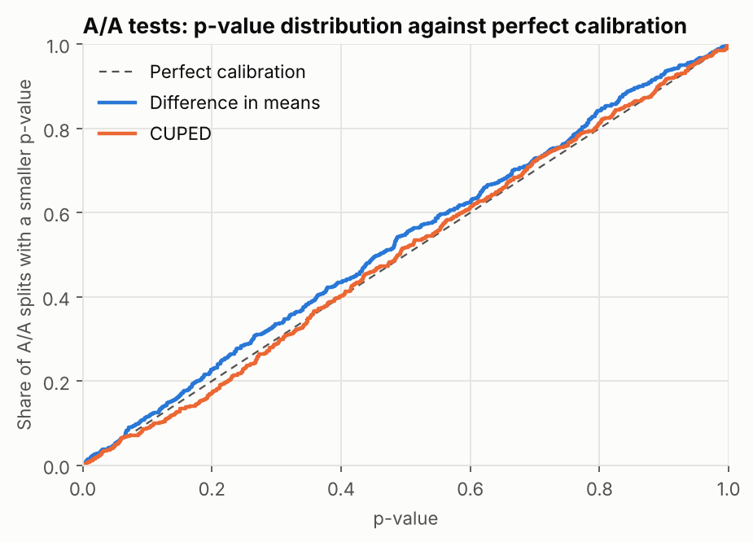
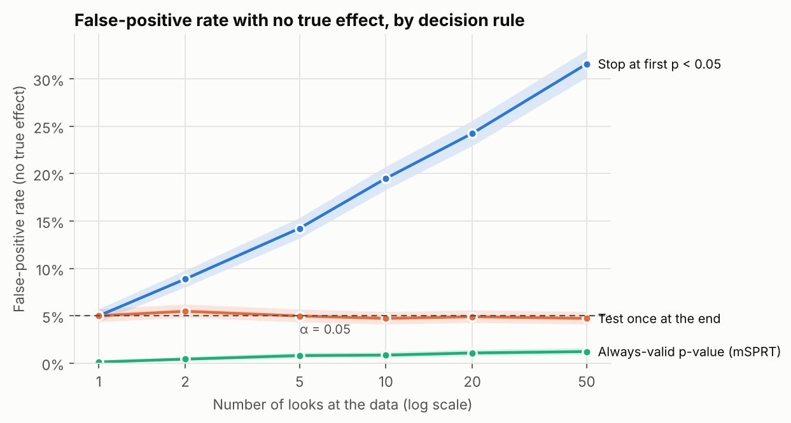
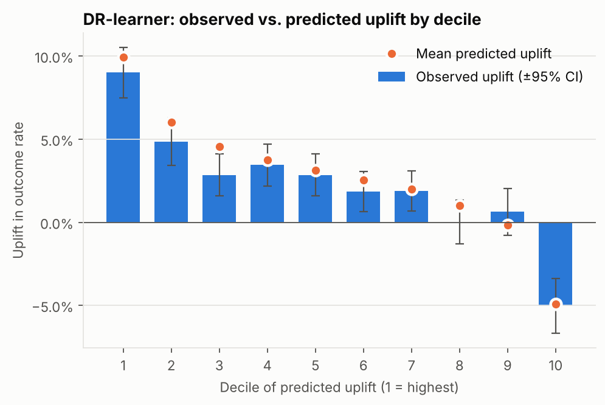

# Reward Uplift Lab: study report

Regenerate with `uplift-lab simulate --n-users 200000 --seed 7`. Data are **simulated** with known ground truth (200,000 users, 50% randomised to a €0.50 bonus reward), so every estimate below can be checked against the true answer. Money figures are EUR per user over the 14-day window unless stated.

## Key findings

1. **Rewarding everyone lifts conversion, but its effect on profit is not distinguishable from zero.** Conversion moves by +2.40 pts (18.3% relative; true +2.28 pts); net revenue per user moves by €+0.011 [€-0.003, €+0.024] (true €-0.002). The reward is also paid to users who would have converted anyway.
2. **Profit-aware targeting beats rewarding everyone.** Rewarding only the 48% of users with positive expected profit earns €41 more per 1,000 users than rewarding everyone [22, 60] (true difference €45).
3. **CUPED cuts the variance of the revenue estimate by 35%** (regression adjustment: 39%). That is the precision of a test with 53% more users, for free.
4. **Peeking is dangerous.** Stopping at the first p < 0.05 over 50 looks gives a 31.6% false-positive rate; always-valid p-values keep it at 1.2%.
5. **A logging bug that drops 10% of low-activity treated users is caught by the sample-ratio check** (p = 3.5e-09; alarm threshold p < 0.001).

## 1. Is the data trustworthy? Sample ratio mismatch

| Pipeline | Treated | Control | Treated share | p-value | Mismatch? |
|---|---|---|---|---|---|
| Healthy | 100,174 | 99,826 | 50.09% | 0.436 | no |
| Broken logging | 97,204 | 99,826 | 49.33% | < 0.001 | **yes** |

The broken pipeline drops treated users with low activity, who convert less than average, so the treated arm looks healthier than it is. Here its conversion estimate, +2.52 pts, overstates the true population effect of +2.28 pts. In a real experiment there is no true value to compare with; the sample-ratio check is what raises the alarm, before anyone reads the effect. It uses a strict threshold (p < 0.001) because it runs on every experiment.

## 2. Average effects

| Metric | Estimator | Estimate [95% CI] | True value | CI covers truth |
|---|---|---|---|---|
| Conversion | Difference in means | +2.40 pts [+2.09 pts, +2.70 pts] | +2.28 pts | True |
| Revenue | Difference in means | €+0.081 [€+0.064, €+0.099] | €+0.075 | True |
| Revenue | CUPED (pre-period revenue) | €+0.088 [€+0.074, €+0.103] | €+0.075 | True |
| Revenue | Regression adjustment (Lin 2013) | €+0.086 [€+0.072, €+0.100] | €+0.075 | True |
| Net revenue (after reward) | CUPED | €+0.011 [€-0.003, €+0.024] | €-0.002 | True |

Adjusting for pre-experiment data narrows the interval without biasing it: the covariate is measured before randomisation, so it cannot differ between arms except by chance.

## 3. Is the analysis calibrated? A/A tests

Control users were split at random 500 times and analysed as if one half had been treated. With no real effect, about 5% of splits should be significant and p-values should be uniform.

| Estimator | False-positive rate | 95% CI | Uniformity test p | Calibrated |
|---|---|---|---|---|
| Difference in means | 5.0% | 3.4% to 7.3% | 0.10 | yes |
| CUPED | 4.6% | 3.1% to 6.8% | 0.59 | yes |

## 4. Planning the next test

- Baseline conversion is 13.1%. Detecting a 1-point lift (80% power, α = 0.05) needs 36,918 users; a 0.5-point lift needs 145,387, about four times as many, because sample size scales with 1 / effect².
- With this experiment's 200,000 users the smallest detectable revenue effect is €0.025 per user; with CUPED it is €0.021.

## 5. Peeking and always-valid inference

4,000 simulated null experiments per row (no true effect), analysed three ways:

| Looks | Test once at end | Stop at first p < 0.05 | Always-valid (mSPRT) |
|---|---|---|---|
| 1 | 5.0% | 5.0% | 0.1% |
| 2 | 5.5% | 8.9% | 0.4% |
| 5 | 5.0% | 14.2% | 0.8% |
| 10 | 4.7% | 19.5% | 0.9% |
| 20 | 4.9% | 24.2% | 1.1% |
| 50 | 4.7% | 31.6% | 1.2% |

Always-valid p-values are not free. With a true effect of 0.04 standard deviations and 20 looks, the fixed-horizon test detects it 80% of the time and the mSPRT 50%; when the mSPRT does detect it, it stops after 61% of the planned sample on average. The trade is lower power for the freedom to monitor and stop early. Replaying this experiment's revenue in arrival order with 20 looks, the naive test is first significant after 10,000 users and the always-valid test after 30,000 users.

## 6. Who responds to the reward? Heterogeneous effects

Four meta-learners were trained on 100,313 users (a quarter of them held back for model selection) and evaluated on 99,687 test users. The Qini areas are all a real analysis can see; the last three columns use the hidden truth.

| Model | Validation Qini | Test Qini | PEHE (lower is better) | Rank corr. with truth | Share of oracle gain |
|---|---|---|---|---|---|
| DR-learner | 0.0039 | 0.0046 | 0.0233 | 0.83 | 87% |
| X-learner | 0.0035 | 0.0043 | 0.0218 | 0.80 | 85% |
| S-learner | 0.0039 | 0.0041 | 0.0252 | 0.77 | 83% |
| T-learner | 0.0034 | 0.0037 | 0.0314 | 0.69 | 76% |

Oracle observed Qini area: 0.0049. Selected model (by highest Qini area on a validation split of the training users): **DR-learner**.

Ranked by the hidden truth: DR-learner (87% of oracle gain), X-learner (85% of oracle gain), S-learner (83% of oracle gain), T-learner (76% of oracle gain). The T-learner fits each arm separately, so its two models make independent errors that do not cancel when subtracted; the X- and DR-learners model the effect itself. The observed Qini area separates the models less sharply than the truth does, because it is computed from noisy outcomes on a finite sample.

Segment view (from `src/uplift_lab/sql/segment_effects.sql`):

| Dimension | Segment | Control rate | Treated rate | Lift ± 1.96 SE |
|---|---|---|---|---|
| activity | low activity | 8.6% | 12.6% | +4.00 pts ± 0.39 |
| activity | active | 17.3% | 18.2% | +0.90 pts ± 0.46 |
| channel | paid_social | 11.6% | 15.1% | +3.57 pts ± 0.50 |
| channel | referral | 13.5% | 15.4% | +1.97 pts ± 0.80 |
| channel | organic | 14.1% | 15.8% | +1.71 pts ± 0.44 |
| country | tier 1 | 13.0% | 15.7% | +2.68 pts ± 0.56 |
| country | tier 2 | 13.1% | 15.5% | +2.38 pts ± 0.48 |
| country | tier 3 | 13.3% | 15.4% | +2.13 pts ± 0.56 |
| tenure | new (<30d) | 13.0% | 20.7% | +7.66 pts ± 0.77 |
| tenure | established (30-179d) | 13.0% | 14.4% | +1.42 pts ± 0.42 |
| tenure | veteran (180d+) | 13.4% | 14.4% | +0.97 pts ± 0.55 |

## 7. Who should get the reward? Profit-aware targeting

Expected incremental profit per user is `payout × uplift − reward cost × P(convert | rewarded)`. Uplift comes from the DR-learner, the treated conversion probability from the T-learner mu1. Each policy is evaluated on held-out randomised users by inverse-propensity weighting against a no-reward baseline, with CUPED-adjusted net revenue as the outcome. All figures are EUR per 1,000 users. The paired comparison against rewarding everyone is much tighter than either value alone, because both policies are scored on the same users.

| Policy | Users rewarded | Gain vs. no rewards [95% CI] | True | Gain vs. rewarding everyone [95% CI] | True |
|---|---|---|---|---|---|
| Reward everyone | 100% | €15 [-13, 42] | €-1 | €0 [0, 0] | €0 |
| Top 30% by uplift | 30% | €41 [26, 56] | €31 | €26 [3, 49] | €32 |
| Positive expected profit | 48% | €56 [36, 75] | €44 | €41 [22, 60] | €45 |
| Profit, budget 25% of full spend | 28% | €57 [41, 73] | €39 | €42 [20, 65] | €40 |
| Oracle (true profit > 0) | 45% | €59 [40, 78] | €49 | €44 [24, 64] | €50 |

Ranking by uplift alone (true €31 per 1,000 users) ignores two things: the reward is also paid to users who would have converted anyway, and payouts differ by country. Ranking by expected profit captures both (true €44). When the reward budget is capped, users are added in order of expected profit per euro of reward spend.

## Limitations

- The data are simulated. The simulator encodes plausible but invented behaviour; the methods are validated against it, not the business conclusions. `uplift-lab criteo` runs the observable parts on the real Criteo Uplift dataset.
- Effects are measured over 14 days. Rewards may shift conversions in time or change long-term behaviour (novelty effects, reward dependence), which a short test misses.
- Policy values are estimated on the same held-out sample, so their errors are correlated; differences between policies are more precise than each value alone.
- Payout per conversion is treated as a known price per country tier, and the reward cost model (T-learner) is fitted on the same training users as the uplift model; errors in either move users across the profit threshold.
- The selected uplift model is chosen on a validation split, so the reported test performance is not inflated by the choice; with four close candidates, which one wins can change with the seed.
- The always-valid test assumes a normal approximation with a plug-in variance and a mixing variance chosen in advance; a badly chosen mixing variance costs power, not validity.
